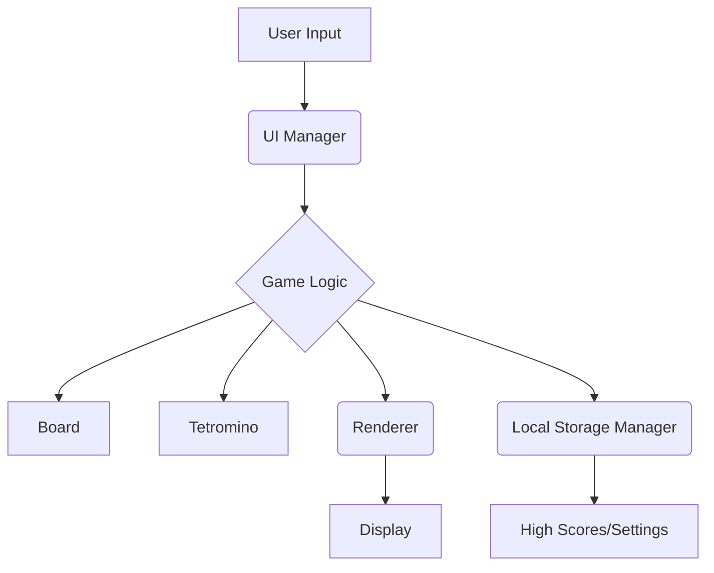

# Project Architecture for Tetris Game

This document outlines the overall architecture and design philosophy of the Tetris Game project.

## 1. Architecture Overview

The Tetris Game is structured into several key modules, each responsible for a specific aspect of the game. This modular design promotes separation of concerns, making the codebase easier to understand, maintain, and extend.

## 2. Design Principles

Our design is guided by the following principles:

*   **Modularity:** Breaking down the game into independent, reusable modules.
*   **Separation of Concerns:** Each module has a single, well-defined responsibility.
*   **Testability:** Designing components that are easy to test in isolation.
*   **Extensibility:** Allowing for easy addition of new features and game modes.

## 3. Details of Main Components

### 3.1. `Game` (src/core/Game.ts)

*   **Responsibility:** Manages the overall game state, including score, level, current tetromino, next tetrominos, and game loop.
*   **Key Methods:** `start()`, `update()`, `handleInput()`, `spawnTetromino()`, `checkCollision()`, `clearLines()`, `gameOver()`.

### 3.2. `Board` (src/core/Board.ts)

*   **Responsibility:** Represents the game board, managing the grid of placed blocks and handling collision detection and line clearing.
*   **Key Methods:** `checkCollision()`, `placeTetromino()`, `clearLines()`, `clear()`.

### 3.3. `Tetromino` (src/core/Tetromino.ts)

*   **Responsibility:** Represents individual Tetris pieces, including their shape, position, type, and rotation logic.
*   **Key Methods:** `move()`, `rotate()`, `getShape()`, `getType()`, `getSkinColor()`.

### 3.4. `Renderer` (src/graphics/Renderer.ts)

*   **Responsibility:** Handles all drawing operations on the HTML canvas, rendering the game board, tetrominos, score, and other UI elements.
*   **Key Methods:** `drawBoard()`, `drawTetromino()`, `drawNextTetrominos()`, `drawHoldTetromino()`, `drawGameOver()`, `clearGameCanvas()`.

### 3.5. `UIManager` (src/ui/UIManager.ts)

*   **Responsibility:** Manages user interface interactions, including keyboard input handling and updating display elements.
*   **Key Methods:** `setupInputHandlers()`, `updateScoreDisplay()`, `updateLevelDisplay()`.

### 3.6. `LocalStorageManager` (src/utils/LocalStorageManager.ts)

*   **Responsibility:** Handles saving and loading game data (e.g., high scores, settings) to and from the browser's local storage.
*   **Key Methods:** `saveItem()`, `loadItem()`, `clearItem()`.

## 4. Data Model

*   **Game State:** Managed within the `Game` class, including `score`, `level`, `currentTetromino`, `nextTetrominos`, `holdTetromino`, `gameOver` status.
*   **Board Grid:** A 2D array (`(string | null)[][]`) representing the game board, where each cell stores the color of the block or `null` if empty.
*   **Tetromino Shape:** A 2D array (`number[][]`) representing the shape of a tetromino, where `1` indicates a filled block and `0` indicates an empty space.

## 5. Reasons for Technology Selection

*   **TypeScript:** Provides static typing, which helps catch errors early in development, improves code readability, and enhances maintainability for larger codebases.
*   **Webpack:** A powerful module bundler that allows us to manage dependencies, transpile TypeScript, and optimize assets for the web.
*   **Jest:** A popular and robust testing framework for JavaScript and TypeScript, providing a comprehensive solution for unit and integration testing.
*   **HTML5 Canvas:** Provides a flexible and performant API for 2D graphics rendering, suitable for game development.

## 6. API Reference (Internal)

This section provides a high-level overview of key methods and properties across the main classes. For detailed API documentation, please refer to the JSDoc comments within the source code files.

*   **`Game` Class:**
    *   `constructor(width: number, height: number)`
    *   `start(): void`
    *   `update(): void`
    *   `handleInput(key: string): void`
    *   `getScore(): number`
    *   `getLevel(): number`
    *   `getHighScore(): number`
    *   `isGameOver(): boolean`

*   **`Board` Class:**
    *   `constructor(width: number, height: number)`
    *   `checkCollision(tetromino: Tetromino, newX: number, newY: number): boolean`
    *   `placeTetromino(tetromino: Tetromino): void`
    *   `clearLines(): number`
    *   `grid: (string | null)[][]`

*   **`Tetromino` Class:**
    *   `constructor(x: number, y: number, type: string, skin: { [key: string]: string })`
    *   `move(dx: number, dy: number): void`
    *   `rotate(): void`
    *   `getShape(): number[][]`
    *   `getType(): string`
    *   `getSkinColor(): string`
    *   `x: number`
    *   `y: number`

*   **`Renderer` Class:**
    *   `constructor(gameCanvasId: string, nextCanvasId: string, holdCanvasId: string, cellSize: number)`
    *   `drawBoard(board: Board): void`
    *   `drawTetromino(tetromino: Tetromino): void`
    *   `drawNextTetrominos(tetrominos: Tetromino[]): void`
    *   `drawHoldTetromino(tetromino: Tetromino | null): void`
    *   `drawGameOver(): void`
    *   `clearGameCanvas(): void`

*   **`UIManager` Class:**
    *   `constructor(game: Game, scoreElementId: string, levelElementId: string, highScoreElementId: string)`
    *   `setupInputHandlers(): void`
    *   `updateScoreDisplay(score: number): void`
    *   `updateLevelDisplay(level: number): void`
    *   `updateHighScoreDisplay(highScore: number): void`

*   **`LocalStorageManager` Class:**
    *   `saveItem(key: string, value: string): void`
    *   `loadItem(key: string): string | null`
    *   `clearItem(key: string): void`
